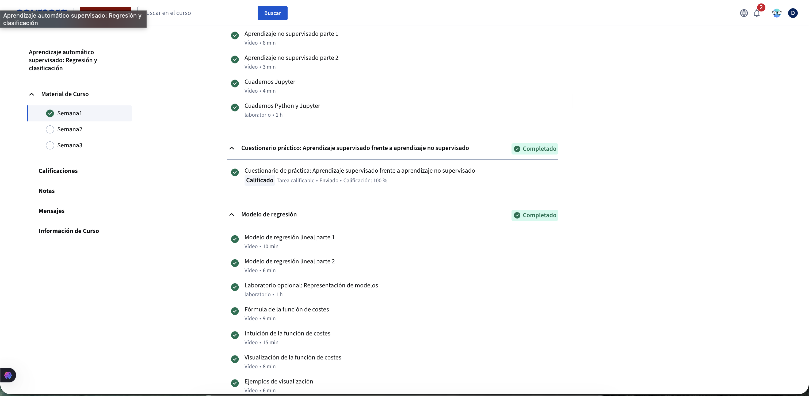
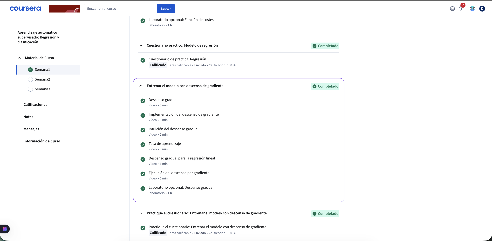

# Actividad Complementaria – Semana 2

## Descripción
Actividad práctica enfocada en el desarrollo de habilidades técnicas relacionadas con el análisis y comprensión de conceptos fundamentales.

## Evidencias

### Evidencia 1

### Evidencia 2

### Evidencia 3

