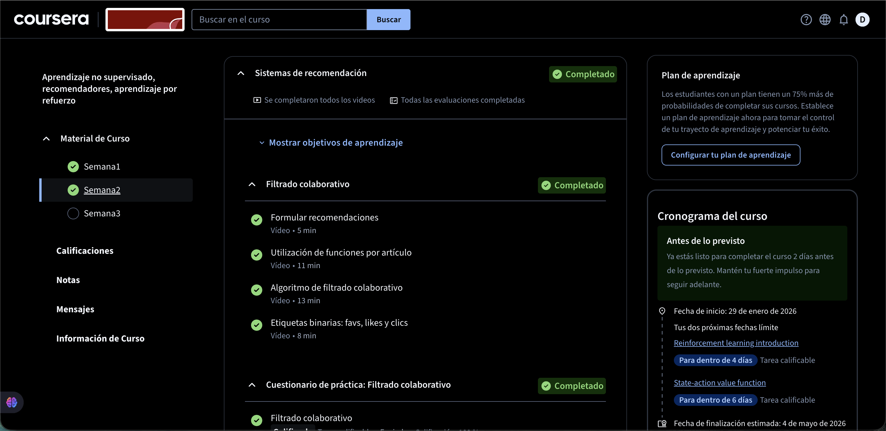
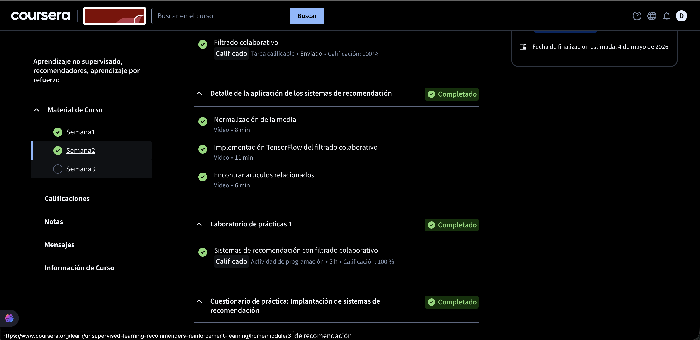
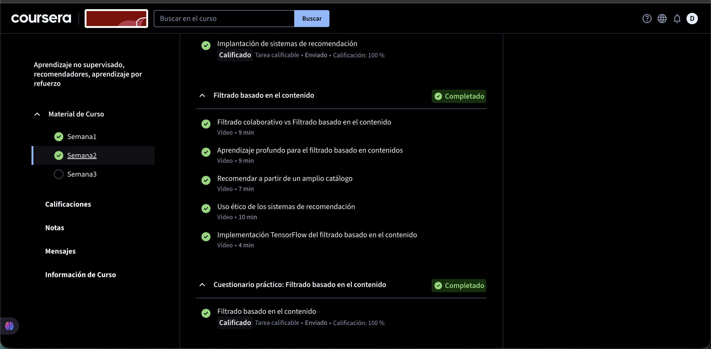
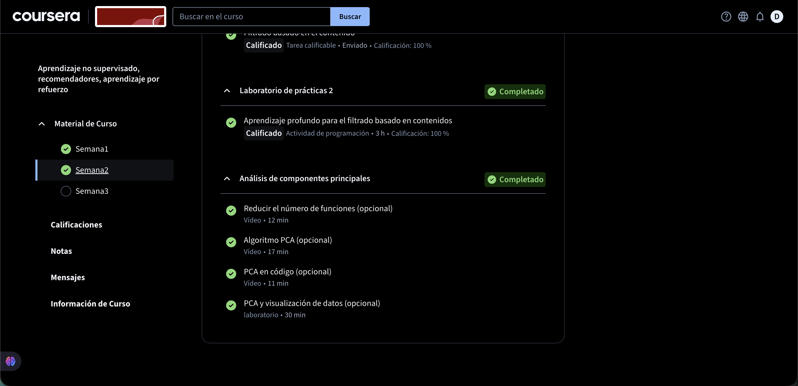

# Semana 2 - Aprendizaje no Supervisado, Recomendadores, Aprendizaje por Refuerzo
## Información del Curso
| Campo | Detalle |
|-------|---------|
| **Plataforma** | Coursera |
| **Curso** | Aprendizaje no supervisado, recomendadores, aprendizaje por refuerzo |
| **Semana** | Semana 2 |
| **Fecha de inicio** | 29 de enero de 2026 |
| **Estado** | ✅ Completado (2 días antes de lo previsto) |

---

## 📌 Descripción
Esta semana se enfocó en el estudio de **sistemas de recomendación**, cubriendo tanto el filtrado colaborativo como el filtrado basado en contenido. Se utilizó **TensorFlow** para implementar ambos enfoques, y se exploró el **Análisis de Componentes Principales (PCA)** como técnica de reducción de dimensionalidad.

---

## 📚 Temas Cubiertos

### 🤝 Sistemas de Recomendación
- Se completaron todos los vídeos
- Todas las evaluaciones completadas

📝 **Estado:** ✅ Completado

---

### 🔁 Filtrado Colaborativo
- Formular recomendaciones (Vídeo • 5 min)
- Utilización de funciones por artículo (Vídeo • 11 min)
- Algoritmo de filtrado colaborativo (Vídeo • 13 min)
- Etiquetas binarias: favs, likes y clics (Vídeo • 8 min)

📝 **Cuestionario de Práctica: Filtrado colaborativo** — Calificación: **100%** ✅

---

### ⚙️ Detalle de la Aplicación de los Sistemas de Recomendación
- Normalización de la media (Vídeo • 8 min)
- Implementación TensorFlow del filtrado colaborativo (Vídeo • 11 min)
- Encontrar artículos relacionados (Vídeo • 6 min)

---

### 🧪 Laboratorio de Prácticas 1
- Sistemas de recomendación con filtrado colaborativo (Actividad de programación • 3 h)

📝 **Calificación: 100%** ✅

---

### 📋 Cuestionario de Práctica: Implantación de Sistemas de Recomendación
- Implantación de sistemas de recomendación

📝 **Calificación: 100%** ✅

---

### 📄 Filtrado Basado en el Contenido
- Filtrado colaborativo vs Filtrado basado en el contenido (Vídeo • 9 min)
- Aprendizaje profundo para el filtrado basado en contenidos (Vídeo • 9 min)
- Recomendar a partir de un amplio catálogo (Vídeo • 7 min)
- Uso ético de los sistemas de recomendación (Vídeo • 10 min)
- Implementación TensorFlow del filtrado basado en el contenido (Vídeo • 4 min)

📝 **Cuestionario Práctico: Filtrado basado en el contenido** — Calificación: **100%** ✅

---

### 🧪 Laboratorio de Prácticas 2
- Aprendizaje profundo para el filtrado basado en contenidos (Actividad de programación • 3 h)

📝 **Calificación: 100%** ✅

---

### 📊 Análisis de Componentes Principales (PCA)
- Reducir el número de funciones (opcional) (Vídeo • 12 min)
- Algoritmo PCA (opcional) (Vídeo • 17 min)
- PCA en código (opcional) (Vídeo • 11 min)
- PCA y visualización de datos (opcional) (Laboratorio • 30 min)

📝 **Estado:** ✅ Completado

---

## 🖼️ Evidencias

### Evidencia 1
Vista general de la Semana 1 completada.

 | Semana 2: inicio — Sistemas de Recomendación y Filtrado Colaborativo completados |

---

### Evidencia 2
Sección de Agrupamiento y laboratorio K-means completados.

 | Detalle de la aplicación, Lab 1 y Cuestionario de Implantación completados |

---

### Evidencia 3
Sección de Detección de anomalías completada.

 | Filtrado Basado en el Contenido y Cuestionario Práctico completados |

---

### Evidencia 4
Laboratorio y cuestionario de detección de anomalías completados.

 | Lab 2 y Análisis de Componentes Principales completados |

## 🔙 Navegación 

- [⬅️ Volver a Curso 3](../)
- [🏠 Volver al repositorio principal](../../../../)
