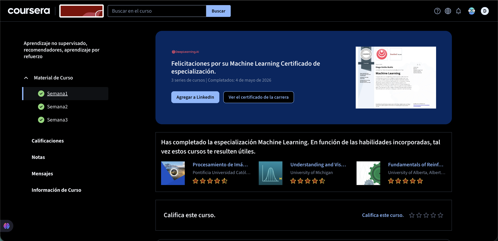

# Semana 3 - Aprendizaje no Supervisado, Recomendadores, Aprendizaje por Refuerzo
## Información del Curso
| Campo | Detalle |
|-------|---------|
| **Plataforma** | Coursera |
| **Curso** | Aprendizaje no supervisado, recomendadores, aprendizaje por refuerzo |
| **Semana** | Semana 3 |
| **Fecha de finalización** | 4 de mayo de 2026 |
| **Estado** | ✅ Completado |

---

## 📌 Descripción
Al completar esta semana se finalizó el tercer y último curso de la **Especialización en Machine Learning** de DeepLearning.AI y Stanford Online. El certificado fue emitido el **4 de mayo de 2026** a nombre de **Diego Emilio Muñiz**.

---

## 🏆 Certificado de Especialización

| Campo | Detalle |
|-------|---------|
| **Especialización** | Machine Learning Specialization |
| **Institución** | DeepLearning.AI / Stanford Online |
| **Instructor** | Andrew Ng — Founder, DeepLearning.AI & Adjunct Professor, Stanford University |
| **Fecha de emisión** | 4 de mayo de 2026 |
| **Cursos completados** | 3 series de cursos |
| **Verificación** | https://coursera.org/verify/specialization/NJ431JISUP5Y |

### 📚 Cursos que conforman la especialización:
1. Supervised Machine Learning: Regression and Classification
2. Advanced Learning Algorithms
3. Unsupervised Learning, Recommenders, Reinforcement Learning

### 🧠 Temas cubiertos en la especialización:
- Aprendizaje supervisado: regresión lineal, regresión logística, redes neuronales, árboles de decisión
- Aprendizaje no supervisado: clustering, detección de anomalías
- Sistemas de recomendación
- Aprendizaje por refuerzo
- Mejores prácticas para construcción de modelos de machine learning

---

## 🖼️ Evidencias

### Evidencia 1
Vista general

---

### Evidencia 2
Certificado en PDF

📄 [Descargar certificado](./certificado621784.pdf)

---

## 🔙 Navegación 

- [⬅️ Volver a Curso 3](../)
- [🏠 Volver al repositorio principal](../../../../)
