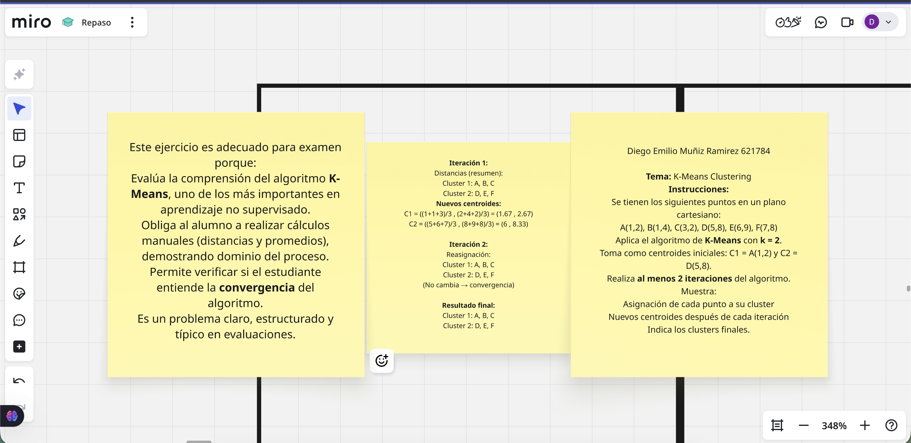

# Repaso P3 - K-Means Clustering

## Información de la Actividad

| Campo | Detalle |
|-------|---------|
| **Materia / Curso** | Inteligencia Artificial |
| **Actividad** | Repaso P3 – K-Means Clustering |
| **Tipo de archivo** | Ejercicio práctico (resuelto a mano) |
| **Estado** | ✅ Completado |

---

## 📌 Descripción

Esta actividad consiste en la aplicación manual del algoritmo **K-Means**, uno de los métodos más importantes en **aprendizaje no supervisado**. El objetivo es demostrar la comprensión del proceso iterativo del algoritmo: asignación de puntos a clusters basada en la distancia a los centroides, y actualización de los centroides mediante el promedio de los puntos asignados.

El ejercicio es adecuado para examen porque:
- Evalúa la comprensión del algoritmo K-Means
- Obliga al alumno a realizar cálculos manuales (distancias y promedios)
- Permite verificar si el estudiante entiende la **convergencia** del algoritmo
- Es un problema claro, estructurado y típico en evaluaciones

---

## 📚 Temas Cubiertos

### 📊 K-Means Clustering
- Algoritmo de clustering particional
- Cálculo de distancia (generalmente Euclidiana)
- Asignación de puntos al centroide más cercano
- Actualización de centroides como media de los puntos del cluster
- Criterio de convergencia (cuando no hay reasignación de puntos)
- Aplicación manual paso a paso

---

## 📊 Conjunto de Datos

Se tienen los siguientes puntos en un plano cartesiano:

| Punto | Coordenadas |
|-------|-------------|
| A | (1, 2) |
| B | (1, 4) |
| C | (3, 2) |
| D | (5, 8) |
| E | (6, 9) |
| F | (7, 8) |

**Parámetros del algoritmo:**
- **Número de clusters (k):** 2
- **Centroides iniciales:**
  - \( C_1 = A(1, 2) \)
  - \( C_2 = D(5, 8) \)

---

## 🧮 Desarrollo del Algoritmo

### Iteración 1

**Asignación de puntos a clusters (por distancia Euclidiana):**

- **Cluster 1 (\( C_1 = (1, 2) \)):** A, B, C
- **Cluster 2 (\( C_2 = (5, 8) \)):** D, E, F

**Cálculo de nuevos centroides:**

\[
C_1 = \left( \frac{1+1+3}{3}, \frac{2+4+2}{3} \right) = (1.67, 2.67)
\]

\[
C_2 = \left( \frac{5+6+7}{3}, \frac{8+9+8}{3} \right) = (6, 8.33)
\]

---

### Iteración 2

**Reasignación de puntos (con los nuevos centroides):**

- **Cluster 1 (\( C_1 = (1.67, 2.67) \)):** A, B, C
- **Cluster 2 (\( C_2 = (6, 8.33) \)):** D, E, F

**No hay cambios en la asignación → El algoritmo ha convergido.**

---

## ✅ Resultado Final

| Cluster | Puntos |
|---------|--------|
| **Cluster 1** | A(1,2), B(1,4), C(3,2) |
| **Cluster 2** | D(5,8), E(6,9), F(7,8) |

---

## 🖼️ Evidencia

| Archivo | Descripción |
|---------|-------------|
| `evidencia1.png` | Imagen que muestra el desarrollo completo del ejercicio de K-Means |

---

## 👤 Autor

**Diego Emilio Muñiz Ramirez**  
Matrícula: 621784

---

## 🔙 Navegación

- [⬅️ Volver a Parcial 3](../)
- [🏠 Volver al repositorio principal](../../)
