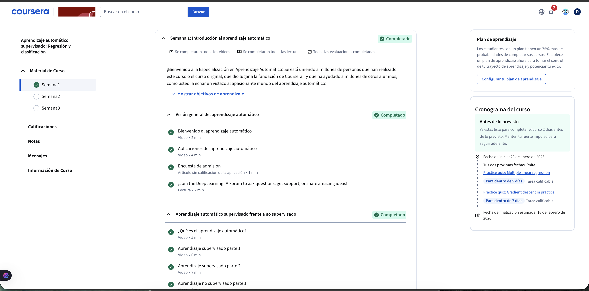
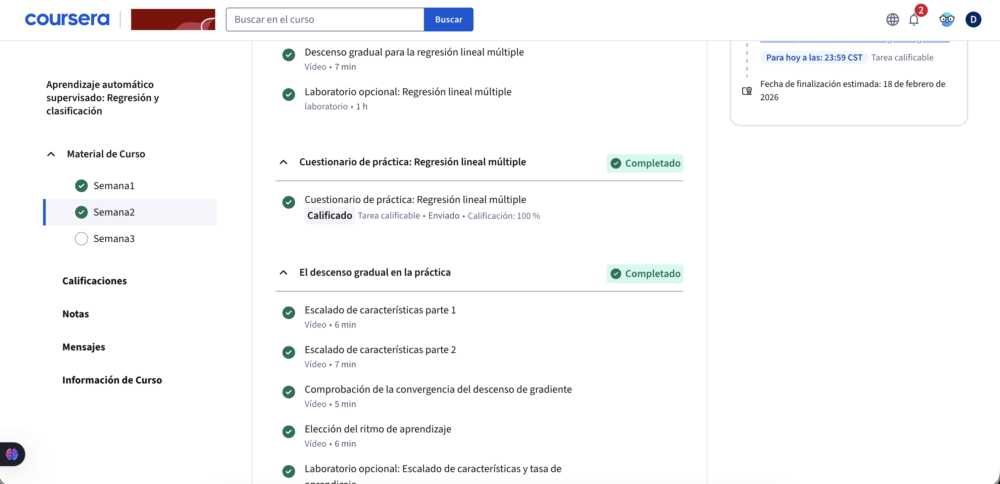
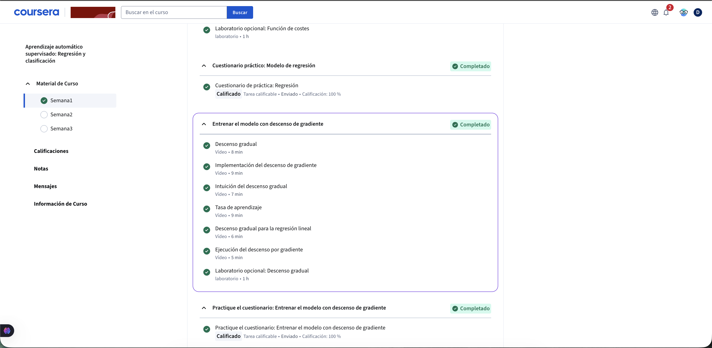

# Certificación – Curso Complementario

## Descripción
Se presentan las evidencias correspondientes a la finalización y certificación de un curso complementario relacionado con el área de análisis de datos y aprendizaje automático.

## Evidencias

### Evidencia adicional 1

### Evidencia adicional 2

### Evidencia adicional 3

