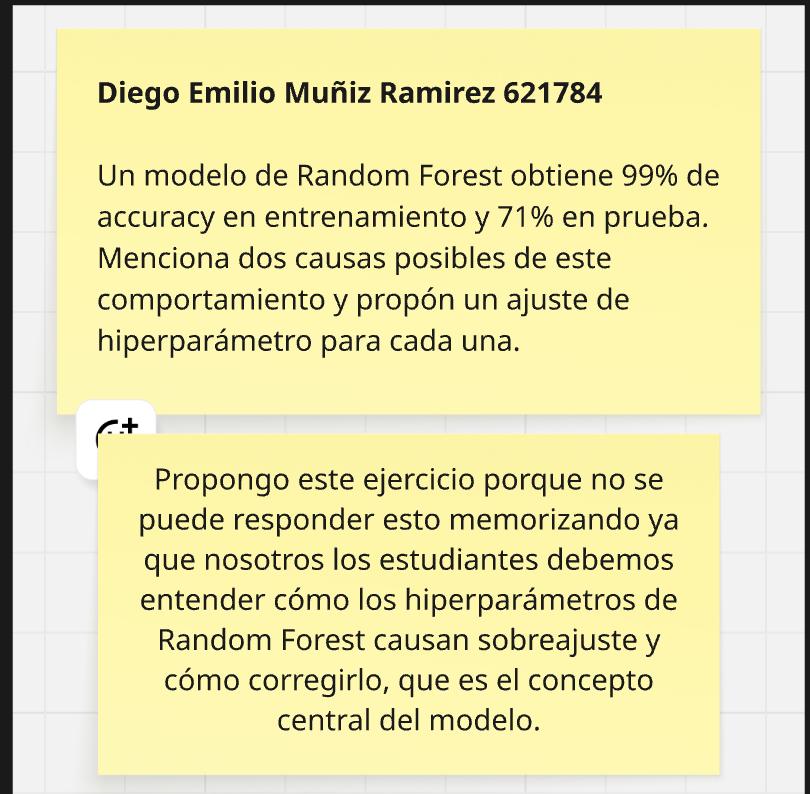
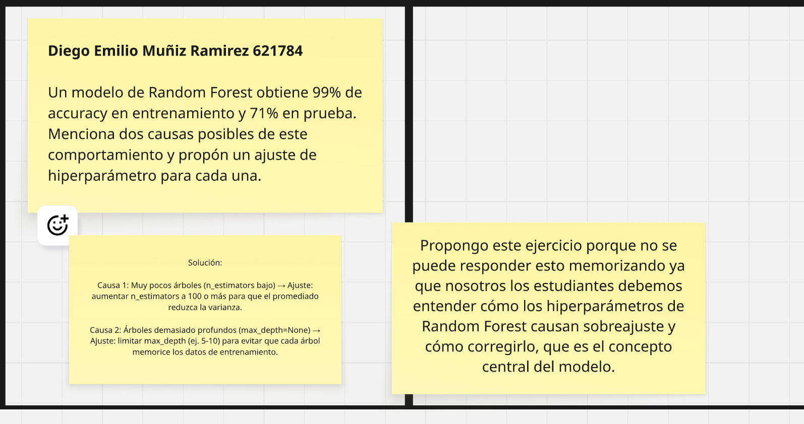

# R2. Repaso Parcial 2

## Información

| Campo | Detalle |
|-------|---------|
| **Alumno** | Diego Emilio Muñiz Ramírez |
| **Matrícula** | 621784 |
| **Curso** | SC3314 – Inteligencia Artificial |
| **Profesor** | Dr. Antonio Torteya |

---

## 📌 Descripción

Ejercicios de repaso para el segundo parcial, enfocados en la comprensión conceptual de modelos de clasificación avanzados. Los ejercicios están diseñados para que el estudiante razone sobre el comportamiento de los modelos y sus hiperparámetros, en lugar de memorizar respuestas.

---

## 🧠 Ejercicio 1 — Sobreajuste en Random Forest

**Pregunta:**
> Un modelo de Random Forest obtiene 99% de accuracy en entrenamiento y 71% en prueba. Menciona dos causas posibles de este comportamiento y propón un ajuste de hiperparámetro para cada una.

**Justificación del ejercicio:**
> Este ejercicio requiere entender cómo los hiperparámetros de Random Forest causan sobreajuste y cómo corregirlo, que es el concepto central del modelo.

**Solución:**

| Causa | Ajuste propuesto |
|-------|-----------------|
| Muy pocos árboles (`n_estimators` bajo) | Aumentar `n_estimators` a 100 o más para que el promedio reduzca la varianza |
| Árboles demasiado profundos (`max_depth=None`) | Limitar `max_depth` (ej. 5–10) para evitar que cada árbol memorice los datos de entrenamiento |

---

## 🖼️ Evidencias

---

## 🔙 Navegación

- [⬅️ Volver a Parcial 2](../)
- [🏠 Volver al repositorio principal](../../)
